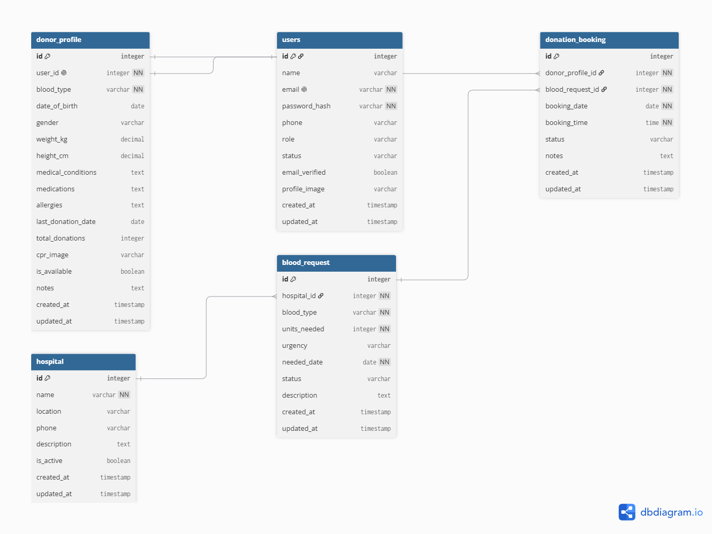

# Healthcare Support System

## Project Description

Healthcare Support System is a backend application designed to connect individuals who want to support the healthcare sector with hospitals and healthcare organizations that need community assistance.

The first version of the platform focuses on blood donation. Hospitals can publish blood requests, while donors can view relevant requests and book donation appointments.

The system is designed to be scalable, allowing future versions to include additional healthcare support services such as medical equipment donation, patient companion services, transportation assistance and other volunteer opportunities.

## Problem Statement

Hospitals and healthcare organizations may face situations where community support is needed, but there is often no centralized system that connects them directly with individuals who are willing to help.

For blood donation specifically, hospitals may need particular blood types within a certain period, while potential donors may not easily know where or when their blood type is needed.

Healthcare Support System aims to provide a centralized platform where healthcare organizations can publish their support needs and community members can find suitable opportunities and respond through an organized process.


## Project Purpose

The purpose of Healthcare Support System is to create a secure and organized platform that makes it easier for individuals to support healthcare organizations.

In the first version, the system focuses on improving the blood donation process by allowing hospitals to publish blood requests and donors to discover these requests and book suitable donation appointments.

The project also aims to provide a strong foundation that can be expanded in the future to support additional healthcare and volunteering services.


## Target Users and Roles

The Healthcare Support System supports three main user roles:

### Donor
A donor is a registered user who wants to support healthcare organizations through blood donation. Donors can manage their profiles, view available blood requests, search for suitable requests, and book or cancel donation appointments.

### Hospital Staff
Hospital staff are authorized users associated with a hospital or healthcare organization. They can create and manage blood requests, view donation bookings, and update booking statuses.

### Admin
The admin manages the overall platform. Admins can manage users and hospitals, deactivate accounts when necessary, and monitor the system.

## Version 1 Scope

The first version of the Healthcare Support System focuses on blood donation support and appointment booking.

### In Scope

- User registration and secure login.
- Email verification.
- Role-based access for Donors, Hospital Staff, and Admins.
- User and donor profile management.
- Profile picture and CPR image upload.
- Hospital management.
- Blood request creation and management.
- Search and filtering of blood requests.
- Donation appointment booking.
- Booking availability management.
- Prevention of conflicting or duplicate bookings.
- Booking cancellation and status updates.
- Email notifications.
- Real-time booking notifications.
- Soft deletion and account deactivation.
- Secure REST API using JWT authentication.
- API documentation using Swagger/OpenAPI.

### Out of Scope for Version 1

The following features are planned for future versions:

- Medical equipment donation and lending.
- Patient companion services.
- Transportation assistance.
- Translation and digital assistance.
- General healthcare volunteering opportunities.
- Volunteer hour tracking and certificates.
- Mobile application.
- SMS notifications.
- Map and location services.
- Advanced analytics and dashboards.

## Database ERD

The following Entity Relationship Diagram represents the database design for the Healthcare Support System.



## Project Architecture

The Healthcare Support System follows a layered backend architecture using Java and Spring Boot.

The project is organized into the following packages:

- **controller** - Handles HTTP requests and REST API endpoints.
- **service** - Contains business logic and system rules.
- **repository** - Handles database operations using Spring Data JPA.
- **model** - Contains the system entities and database models.
- **dataTransferObject** - Contains request and response objects used to transfer data between the client and the application.
- **security** - Handles authentication, authorization, and JWT security.
- **exception** - Handles custom exceptions and global error handling.
- **config** - Contains application and security configuration.

### Package Structure

```text
com.ga.healthcaresupport
│
├── controller
├── service
├── repository
├── model
├── dataTransferObject
│   ├── request
│   └── response
├── security
├── exception
└── config
```

### Application Flow

```text
Client / Postman
        ↓
Controller
        ↓
Data Transfer Object + Validation
        ↓
Service
        ↓
Business Rules
        ↓
Repository
        ↓
PostgreSQL
```
## REST API Endpoints

## AUTHENTICATION

POST /auth/register
→ Register a new user

POST /auth/login
→ Login and receive JWT token

GET /auth/verify-email
→ Verify user's email

POST /auth/forgot-password
→ Request password reset email

POST /auth/reset-password
→ Reset forgotten password


## USER PROFILE

GET /api/users/profile
→ View my profile

PUT /api/users/profile
→ Update my profile

PUT /api/users/profile/image
→ Upload or update profile picture

PUT /api/users/change-password
→ Change password while logged in


## DONOR PROFILE


POST /api/donors/profile
→ Create donor profile

GET /api/donors/profile
→ View my donor profile

PUT /api/donors/profile
→ Update my donor profile

PUT /api/donors/profile/cpr-image
→ Upload or update CPR image


## HOSPITALS


GET /api/hospitals
→ View active hospitals

GET /api/hospitals/{hospitalId}
→ View one hospital

POST /api/hospitals
→ Create hospital
→ ADMIN only

PUT /api/hospitals/{hospitalId}
→ Update hospital
→ ADMIN only

DELETE /api/hospitals/{hospitalId}
→ Soft delete / deactivate hospital
→ ADMIN only


## BLOOD REQUESTS


GET /api/blood-requests
→ View blood requests

GET /api/blood-requests/{requestId}
→ View one blood request

POST /api/blood-requests
→ Create blood request
→ HOSPITAL_STAFF only

PUT /api/blood-requests/{requestId}
→ Update blood request
→ HOSPITAL_STAFF only

PUT /api/blood-requests/{requestId}/status
→ Update request status
→ HOSPITAL_STAFF only


Filtering examples:

GET /api/blood-requests?bloodType=O+
GET /api/blood-requests?urgency=URGENT
GET /api/blood-requests?status=OPEN


## DONOR BOOKINGS

POST /api/blood-requests/{requestId}/bookings
→ Create donation booking

GET /api/donors/bookings
→ View my bookings

GET /api/donors/bookings/{bookingId}
→ View one of my bookings

PUT /api/donors/bookings/{bookingId}/cancel
→ Cancel my booking


## HOSPITAL STAFF BOOKINGS


GET /api/hospital/bookings
→ View bookings for my hospital

GET /api/hospital/bookings?status=PENDING
→ Filter hospital bookings by status

PUT /api/hospital/bookings/{bookingId}/confirm
→ Confirm donation booking

PUT /api/hospital/bookings/{bookingId}/complete
→ Mark donation booking as completed


## ADMIN


GET /api/admin/users
→ View all users

GET /api/admin/users/{userId}
→ View one user

DELETE /api/admin/users/{userId}
→ Soft delete / deactivate user

PUT /api/admin/users/{userId}/activate
→ Reactivate user